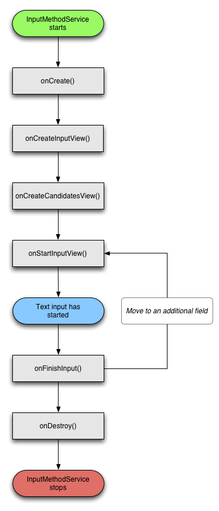

# ime latinime
1. [AndroidManifest.xml -> declare ime(input method editor) as service][ime1]
2. life cycle of ims (input method service) is as :

1. the ime lifecycle.
2. declaring ime components in the application manifest.
3. the ime api.
4. designing an ime ui.
5. sending text from an ime to an application.
6. working with ime subtypes.

[ime1]: [http://www.dre.vanderbilt.edu/~schmidt/android/android-4.0/out/target/common/docs/doc-comment-check/resources/articles/creating-input-method.html]
